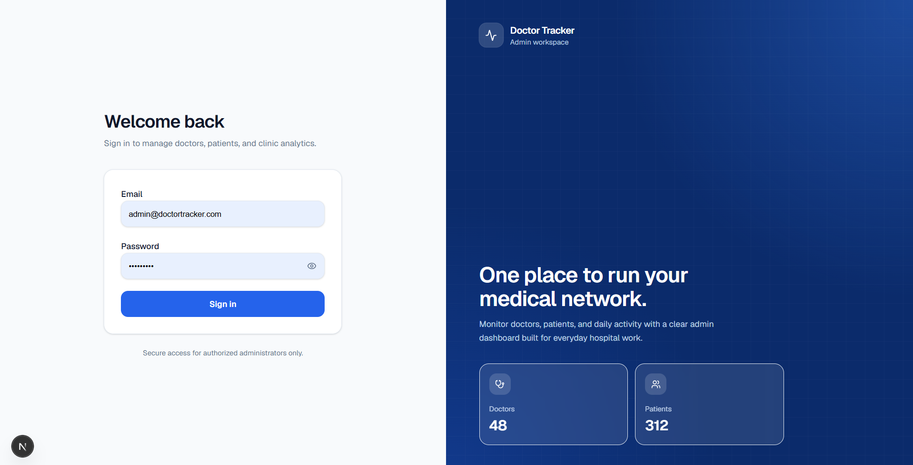
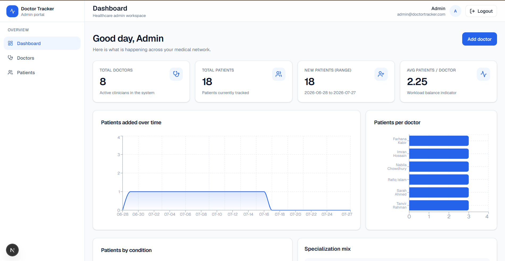
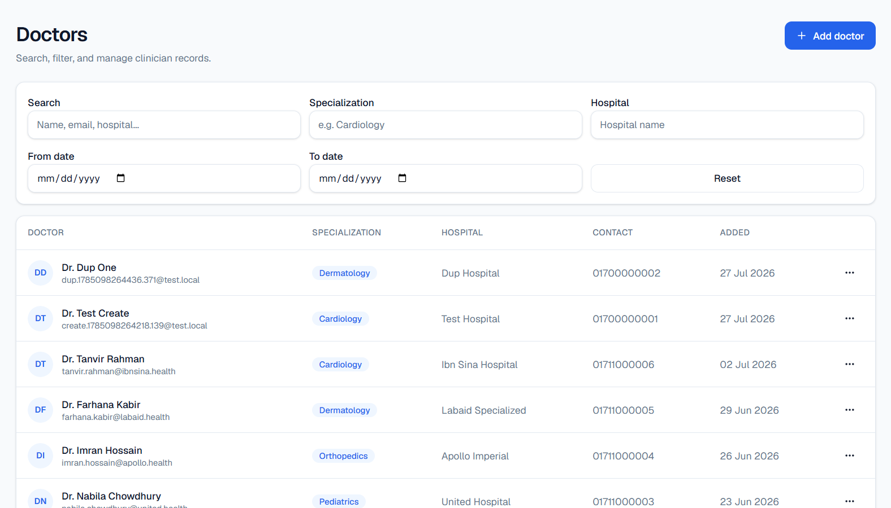
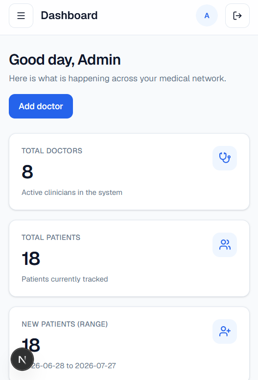
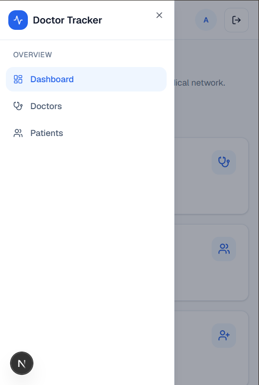
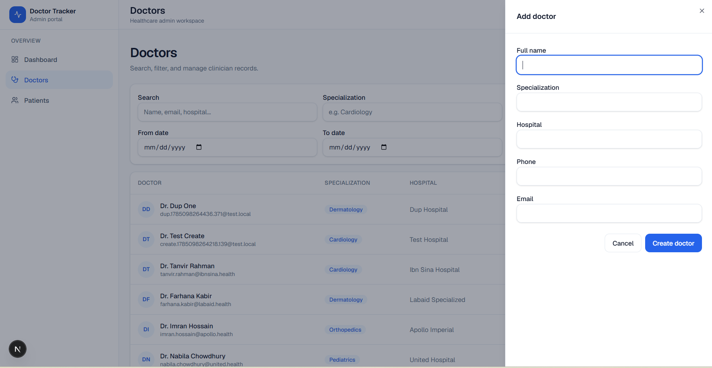

# Doctor Tracker

Doctor Tracker is a secure administrative workspace for managing doctors, patients, and clinic-level analytics. It combines a responsive Next.js interface with an Express REST API integrated into the same application, backed by MongoDB.

## Highlights

- Secure admin login with an httpOnly JWT cookie and protected portal routes
- Doctor directory with create, edit, search, date filters, relevant filters, and pagination
- Patient management with create, edit, delete, doctor, condition, date, and search filters
- Doctor detail pages with linked patient records
- Dashboard metrics and visual workload, registration, condition, and specialization insights
- Shareable 7/30/90-day dashboard ranges with prior-period registration comparison
- Demo data, API integration tests, production Docker image, and environment template

## Tech stack

| Area | Tools |
| --- | --- |
| Application | Next.js 16, TypeScript, App Router |
| API | Node.js, Express 5 mounted through a Next.js API catch-all |
| Data | MongoDB, Mongoose |
| Client data | Redux Toolkit and RTK Query |
| UI | Tailwind CSS, Radix UI primitives, Lucide icons |
| Visualizations | Recharts |
| Validation and security | Zod, bcryptjs, JWT, httpOnly cookies |

## Screenshots

### Authentication



### Desktop portal

| Dashboard | Doctor directory |
| --- | --- |
|  |  |

### Responsive experience

| Dashboard on mobile | Mobile navigation | Add-doctor workflow |
| --- | --- | --- |
|  |  |  |

Screenshots are stored under `public/visual/` so they render in GitHub and remain part of the project source.

## Local setup

### Prerequisites

- Node.js 20 or later
- npm
- A MongoDB Atlas connection string or local MongoDB instance

### Install and run

```bash
git clone <your-repository-url>
cd doctor-tracker
cp .env.example .env.local
npm install
```

Update `.env.local` with a valid `MONGODB_URI`, a strong `JWT_SECRET`, and the desired `SEED_ADMIN_*` values. Then create local data and start the app:

```bash
npm run seed:admin
npm run seed:demo
npm run dev
```

Open [http://localhost:3000](http://localhost:3000).

### Demo credentials

The seed command creates the admin from `.env.local`.

| Field | Value |
| --- | --- |
| Email | `SEED_ADMIN_EMAIL` (default: `admin@doctortracker.com`) |
| Password | `SEED_ADMIN_PASSWORD` |

`npm run seed:demo` resets doctor and patient collections and loads 6 doctors with 20 patients. Run it only when resetting demo data is acceptable.

## Environment variables

Copy `.env.example` to `.env.local`; never commit `.env.local`.

| Variable | Required | Purpose |
| --- | --- | --- |
| `MONGODB_URI` | Yes | MongoDB connection string |
| `JWT_SECRET` | Yes | Secret used to sign access tokens |
| `JWT_EXPIRES_IN` | No | Token lifetime; defaults to `7d` |
| `CLIENT_ORIGIN` | No | Browser origin for Express CORS configuration |
| `APP_TIMEZONE` | No | Timezone used for date analytics |
| `NEXT_PUBLIC_API_URL` | No | API base path; defaults to `/api` |
| `SEED_ADMIN_EMAIL` | Yes | Initial administrator email |
| `SEED_ADMIN_PASSWORD` | Yes | Initial administrator password |
| `SEED_ADMIN_NAME` | No | Initial administrator display name |

## Scripts

| Command | Purpose |
| --- | --- |
| `npm run dev` | Start Next.js and the integrated Express API on port 3000 |
| `npm run build` | Create a production Next.js build |
| `npm start` | Serve the production build |
| `npm run lint` | Run ESLint |
| `npm test` | Create an isolated test database, start the app on port 3000, run API tests, then clean up |
| `npm run seed:admin` | Create the bootstrap admin if it does not already exist |
| `npm run seed:demo` | Replace demo doctors and patients with the sample dataset |
| `npm run test:db` | Verify the MongoDB connection |
| `npm run report:queries` | Print MongoDB execution plans for key list and filter queries |

### Integration tests

```bash
cp .env.test.example .env.test
# Set test-only Atlas/local MongoDB credentials in .env.test.
# Ensure nothing else is using port 3000.
npm test
```

The runner refuses to use a database whose name does not include `test`, starts the integrated API itself, and removes all test data after the suite completes. This keeps development data isolated and makes the command suitable for CI.

### Query-plan evidence

Run the following against a realistically seeded database to inspect the MongoDB winning plan and execution statistics for doctor and patient list queries:

```bash
npm run report:queries
```

Record `executionTimeMillis`, `totalDocsExamined`, `totalKeysExamined`, `nReturned`, and `winningPlan` when preparing performance evidence. This gives concrete proof that indexes support the important query paths instead of only documenting their existence.

The latest local sample result is recorded in [Query Performance Evidence](./docs/query-performance.md).

## Docker

The production `Dockerfile` uses Next.js standalone output, a non-root runtime user, and no application secrets baked into the image.

```bash
docker build -t doctor-tracker .

docker run --rm -p 3000:3000 \
  --env-file .env.local \
  -e NODE_ENV=production \
  -e CLIENT_ORIGIN=http://localhost:3000 \
  doctor-tracker
```

Open [http://localhost:3000](http://localhost:3000). Docker only runs the app; MongoDB remains the database configured through `MONGODB_URI`.

For an HTTPS deployment on a different frontend origin, set `CLIENT_ORIGIN` to that exact origin. The auth cookie is secure in production, so browser testing should use HTTPS outside localhost.

### Docker Compose (app + local MongoDB)

`docker-compose.yml` starts MongoDB with a named persistent volume, seeds the local database, and then starts the app.

```bash
docker compose up --build
```

Open [http://localhost:3000](http://localhost:3000). Compose uses `.env.local` for the JWT and seed-admin settings, but overrides `MONGODB_URI` so the application uses its local `mongo` service. Stop the stack with `docker compose down`; include `-v` only when you intentionally want to delete the local MongoDB volume.

## Architecture

```text
src/
├── app/                  # Next.js pages and protected app layout
├── components/           # Shared layout and UI primitives
├── features/             # Feature-focused client UI and RTK Query endpoints
├── pages/api/[...path].ts# Mounts Express inside the Next.js API layer
├── server/
│   ├── features/         # Auth, doctors, patients, dashboard, and users
│   ├── shared/           # Validation, errors, JWT, pagination, query helpers
│   └── app.ts            # Express middleware and route composition
└── store/                # Redux store and RTK Query base API
tests/                    # API integration tests
scripts/                  # Seed and database utility scripts
```

### Request flow

```text
Browser UI
  → RTK Query
  → /api/*
  → Next.js API catch-all
  → Express routes
  → controller → service → repository
  → Mongoose → MongoDB
```

## Technical decisions

### Express integrated with Next.js

The Express app is mounted through `src/pages/api/[...path].ts`, keeping the REST API familiar while retaining one Next.js application and deployment unit. The handler connects to MongoDB before routing requests and awaits the response lifecycle to prevent premature API completion.

### RTK Query over ad-hoc client fetching

RTK Query centralizes API requests, caching, loading states, and mutation invalidation. After a doctor or patient mutation, relevant list and dashboard queries are invalidated, preventing stale statistics without manual cache synchronization.

### Query and dashboard performance

Doctor and patient listings use capped pagination, indexed searches, and server-side filters. Dashboard insights are computed with MongoDB aggregation pipelines rather than loading full collections into the browser.

### Authentication model

Access tokens are stored in httpOnly, `SameSite=Lax` cookies rather than browser storage. API routes enforce authentication and admin authorization; Next `proxy.ts` and a client session guard prevent unauthenticated access to portal pages. Login input is validated, passwords are hashed with bcrypt, and login attempts are rate limited. The Next.js configuration adds clickjacking, MIME-sniffing, referrer, and browser-permission protection headers.

The supplied rate limiter uses in-memory state, which is appropriate for a single-instance demonstration. A multi-instance deployment should replace it with a shared store such as Redis.

## Routes and REST API

| Area | UI route | API capabilities |
| --- | --- | --- |
| Authentication | `/login` | `POST /api/auth/login`, `POST /api/auth/logout`, `GET /api/auth/me` |
| Dashboard | `/dashboard` | `GET /api/dashboard` |
| Doctors | `/doctors`, `/doctors/[id]` | Create, list, search/filter/paginate, get, update, add/list/remove patients |
| Patients | `/patients` | List/search/filter/paginate, update, delete |

## Submission checklist

- [ ] `.env.local` is not committed
- [ ] `.env.test` is not committed; `.env.test.example` contains placeholders only
- [ ] `.env.example` contains placeholders only
- [ ] `npm run lint` and `npm test` pass
- [ ] Desktop and mobile screenshots are added under `public/visual/` and linked above
- [ ] A production Docker image builds successfully
